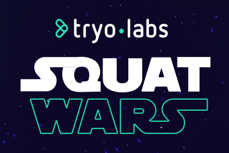

<p align="center">
  
</p>

Tryolabs demo featured at [Khipu 2023](https://khipu.ai/) consisting of a squat counter game running on a Raspberry Pi 4 together with a Coral TPU. The initial code was based on a [TensorFlow Lite pose estimation](https://github.com/tensorflow/examples/tree/master/lite/examples/pose_estimation/raspberry_pi) example.

## Preview

https://user-images.githubusercontent.com/29715691/225156688-2263248d-8c19-476b-b013-176d1b09b1ad.mp4

## How to Install

1. Clone the repository

   ```bash
   git clone git@github.com:tryolabs/squat-wars.git
   cd squat-wars
   ```

2. Install [poetry](https://python-poetry.org/docs/#installing-with-the-official-installer)

   ```
   curl -sSL https://install.python-poetry.org | python -
   ```

3. Select Python `3.9.10` for your environment. If using pyenv, we suggest you do:
   ```bash
   pyenv shell 3.9.10
   pyenv which python | xargs poetry env use
   ```
4. Install dependencies and download models
   ```bash
   poetry install
   sh setup.sh
   ```

## How to Run

The game can be launched with the following command

```bash
poetry run python squat_wars/main.py
```

Additionally, there are a couple of flags that allow the behavior to be customized:

| Argument   | Description                      | Required | Default                                        |
| ---------- | -------------------------------- | -------- | ---------------------------------------------- |
| `--model`  | Path to the model `.tflite` file | No       | `squat_wars/models/movenet_thunder_tpu.tflite` |
| `--camera` | Camera ID. Set to 0 for webcam   | No       | `0`                                            |

A camera needs to to exist for the game to work. It should also support a resolution of `800x448` as it is the current default. If it doesn't, these values can be changed at [squat_wars/game_state.py](squat_wars/game_state.py).

> **Note**: At the moment only single pose movenet models are supported. The name of the supported models are:
>
> - movenet_lightning
> - movenet_thunder
> - movenet_lightning_tpu
> - movenet_thunder_cpu

An example with both flags would be the following

```bash
poetry run python squat_wars/main.py --camera 0 --model squat_wars/models/movenet_lightning.tflite
```
